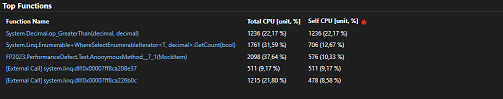

# Functional Programming - Exercise 2 (25 Points)

---


* **Exercise 1: Reducing expressions** (10 Points), Given the definition `double x = x + x`, calculate the evaluations of `double (double 2)` using (a) call-by-name evaluation and (b) call-by-value evaluation. Hint: similar evaluations can be found in the slides of Lecture 2 when we discussed evaluation strategies.

* **Exercise 2: Understanding performance defects** (11 Points), During a performance profiling session you find out that significant time is spent in a seemingly non-complex function for computing the average of all products prices associated with a customer in a DB. 
  
  
  
  You proceed by creating a simple test setup end up with this code:


  ```
	public static void Test()
	{
		var testData = PerformanceDefect.testData;

		// measure runtime quickly...
		var sw = System.Diagnostics.Stopwatch.StartNew();
		Console.WriteLine($"Computing stats for {testData.Count()} customers");

		// collect all items from all customers.
		var allItems = testData.SelectMany(customer => customer.Items);
		// only count non-zero items.
		var onlyValidPrices = allItems.Where(i => i.Price > 0);

		// get the number of elements
		var count = onlyValidPrices.Count();
		// extract all prices of the valid elements.
		var prices = onlyValidPrices.Select(item => item.Price);
		Console.WriteLine($"In total there are {prices.Count()} items.");
		// finally compute the average price.
		var averagePrice = prices.Sum() / count;

		sw.Stop();
		Console.WriteLine($"average price: ${averagePrice}");
		Console.WriteLine($"Took: {sw.Elapsed.TotalMilliseconds} ms");

	}
  ```

  The full code is avaiable [here](https://pastebin.com/b4gyJ5QK). The goal of this exercise is to think about potential problems/pitfalls when working on-demand/lazily evaluated sequences which can be found in most programming languages (e.g. C# LINQ, Java Streams or C++ ranges). Analyze the problem and answer those questions (just one sentence suffices):
	* What parts of the code are suspect to performance problems and why (look at LINQ queries)? It can be answered in one sentence, reference the line numbers if needed? (3 Points)
	* How can it be fixed? Describe the approach. You don't need to rewrite the program but just argue what needs to be changed (one sentence suffices). (3 Points)
	* How would you educate your co-workers to write more efficient code when it comes to lazy sequences? (5 Points, keep it very short)


* **Exercise 3: Practical implications** (4 Points). Think about practical implications of the lecture. Can you think of a reasons why LINQ or Streams have been implemented using on-demand evaluation in C# and Java? What is the advantage of on-demand and lazy evaluation? 

---

* **Sumbission.** Submit your solution as condensed as possible, e.g. as a markdown or text file.
